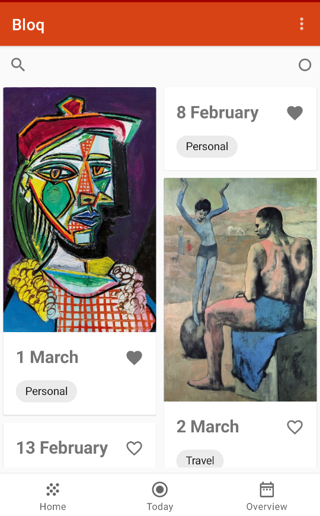
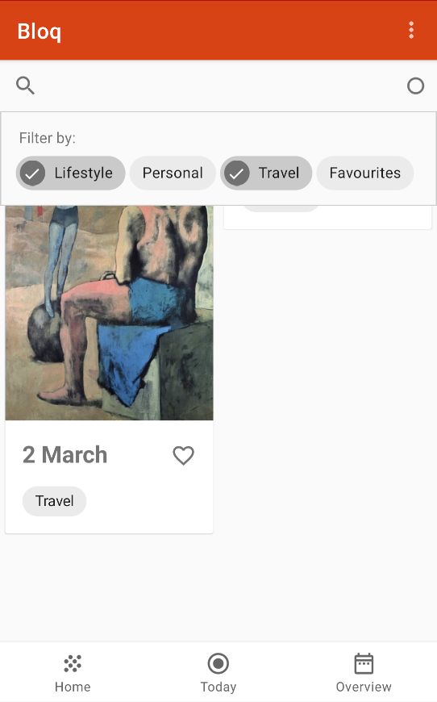
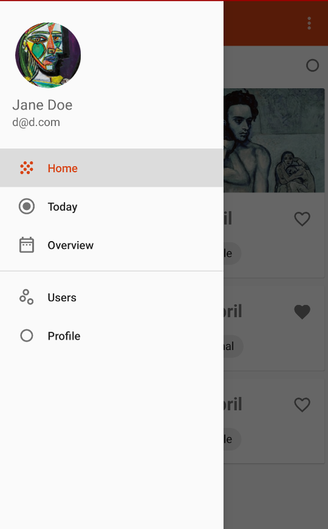
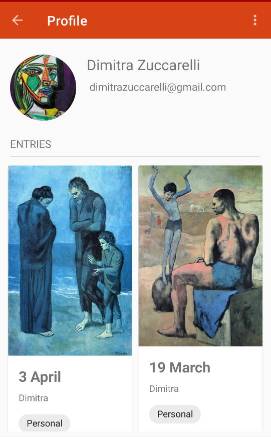
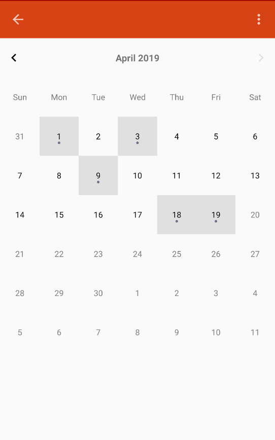

# Bloq

A prompt journal app for Android in Kotlin

### Design

Splash page | Homepage | Filter categories
--- | --- | ---
|||
Navigation drawer | Users | Profile | 
 | |
Calendar | Google Signin | Edit entry
||

### Functionality 
- CRUD: Update, list, delete, create new entries, users, categories
- Search and filter by categories/tags 
- Follow users, view public profiles and public journal entries
- Integration with [Material Calendar View](https://github.com/prolificinteractive/material-calendarview)
- Entry fragment pager to swipe through entries
- Image picker, load images with [Glide](https://github.com/bumptech/glide)

### Model & Persistence
- 3 Models: 
  - `CalendarDate`
  - `JournalEntry`
  - `FirebaseStore`
- Data persistence with Firebase Realtime Database and Firebase Storage for images

### UX
- Navigation Drawer (previously bottom navigation)
- Recycler view with card view for home page and entry prompts list to lazy load cards
- Use of UI elements like progress bar, overflow menu, search view, material design chips, custom checkboxes, alert dialog
- Load images with [Glide](https://github.com/bumptech/glide)
- Adherence to Material Design [Guidelines](https://material.io/design/guidelines-overview/#addition)
- Up navigation support

### Architecture 
- Jetpack [Navigation Architecture Component](https://developer.android.com/topic/libraries/architecture/navigation.html)
- Jetpack [Data binding](https://developer.android.com/topic/libraries/data-binding/)
- Jetpack [Mutable Live Data](https://developer.android.com/topic/libraries/architecture/livedata) 
- Model View [ViewModel](https://developer.android.com/topic/libraries/architecture/viewmodel) pattern
- Use of fragments
- Use of [KTX](https://developer.android.com/kotlin/ktx) and [AndroidX](https://developer.android.com/jetpack/androidx) extensions

## Extra notes
Built with CircleCI and [ktlint](https://github.com/shyiko/ktlint)
